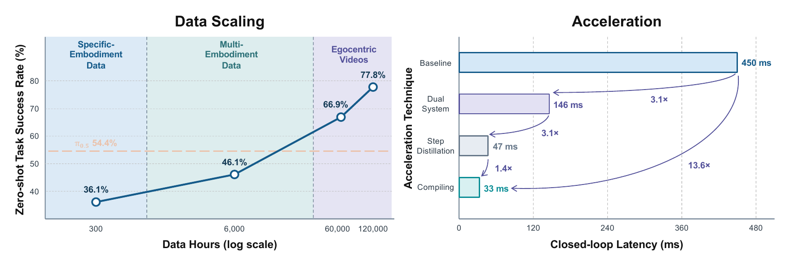

<div align="center">

<h1>Zima<span style="color: #0047AB;">Blue</span>: Evolving Generalizable World Action Models through Scalable Video Pre-training</h1>

<p align="center">
  <a href="https://arxiv.org/pdf/2609.00188">
    
  </a>
  <a href="https://zimablue-wam.github.io/">
    
  </a>
  <a href="https://huggingface.co/papers/2609.00188">
    
  </a>
</p>

</div>

<p align="center">
  
</p>

## Abstract

Robotic manipulation faces a fundamental scaling challenge: robust generalization demands broad physical experience, yet action-labeled robot trajectories are expensive to collect and inherently limited in diversity. Egocentric videos offer a far more scalable source of embodied experience, capturing object interactions, contact dynamics, tool use, and long-horizon behaviors across diverse environments. The central challenge is how to convert this abundant but action-free experience into effective robot control. We introduce **ZimaBlue**, a scalable framework for learning generalizable World Action Models (WAMs) from large-scale video. ZimaBlue follows a three-stage training curriculum: it first performs causal embodied video pre-training on large-scale human and robot egocentric videos, then grounds the learned visual dynamics in heterogeneous robot trajectories through video-action mid-training with a unified action representation, and finally specializes the model to a target robot for deployment. To make generative WAMs practical for real-time control, ZimaBlue further adopts an asynchronous Slow-Fast dual-system architecture, where a high-capacity Slow world model provides generalizable spatiotemporal representations and a lightweight Fast branch enables ***30 Hz action prediction*** on an NVIDIA RTX 4090 GPU. On real-robot zero-shot evaluations, scaling from target-robot data alone to over ***120,000 hours of embodied video improves success from 36.1% to 77.8%***. ZimaBlue further delivers strong performance across multiple benchmarks, with particularly pronounced gains on unseen tasks.

## Why ZimaBlue?

The name **ZimaBlue** is inspired by *Zima Blue*, an episode of *Love, Death & Robots* about a journey through ever greater scale and complexity that ultimately returns to the simple blue tile where it began. We use the name to express how we see robot learning: robots evolve by learning from broader experience, building richer models of the physical world, and turning that knowledge into increasingly capable behavior. ZimaBlue is one step in this continuing process. The next stage of this evolution is coming soon.

## Contributions

This work makes three contributions:

- We present **ZimaBlue**, framing video scaling as a practical route toward generalizable World Action Models, and provide empirical evidence that scaling video pre-training significantly improves zero-shot generalization and strengthens performance on challenging manipulation benchmarks.
- We introduce a three-stage training framework comprising egocentric video pre-training, multi-embodiment video-action mid-training, and target-robot post-training, coupled with a unified state-action representation.
- We propose a Slow-Fast WAM architecture that enables 30 Hz closed-loop physical robot control.

## Citation

```bibtex
@misc{wu2026zimablueevolvinggeneralizableworld,
  title={ZimaBlue: Evolving Generalizable World Action Models through Scalable Video Pre-training},
  author={Xionghao Wu and Yijun Yang and Shiyang Zhou and Haoze Sun and Jianhui Liu and Songsong Yu and Jiyao Zhang and Wenbo Li and Bo Wang and Guoqing Ma and Lin Song and Renjie Liao and Shenghe Zheng and Wei Tang and Xiaojuan Qi and Yanwei Li and Yuan Zhang and Zhuotao Tian and Haoyang Huang and Nan Duan},
  year={2026},
  eprint={2609.00188},
  archivePrefix={arXiv},
  primaryClass={cs.CV},
  url={https://arxiv.org/abs/2609.00188}
}
```
 
